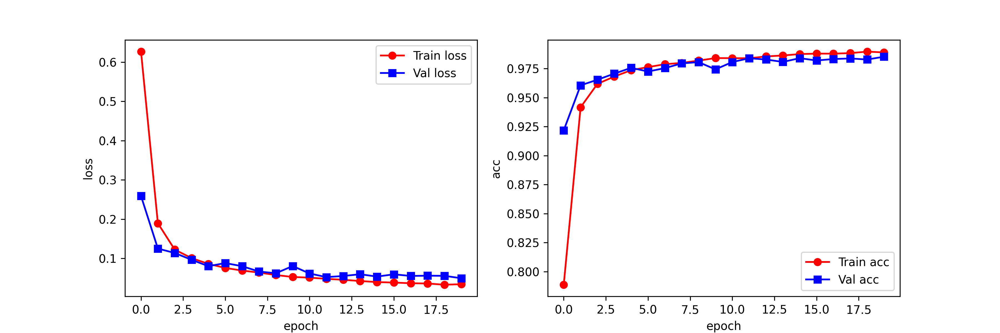
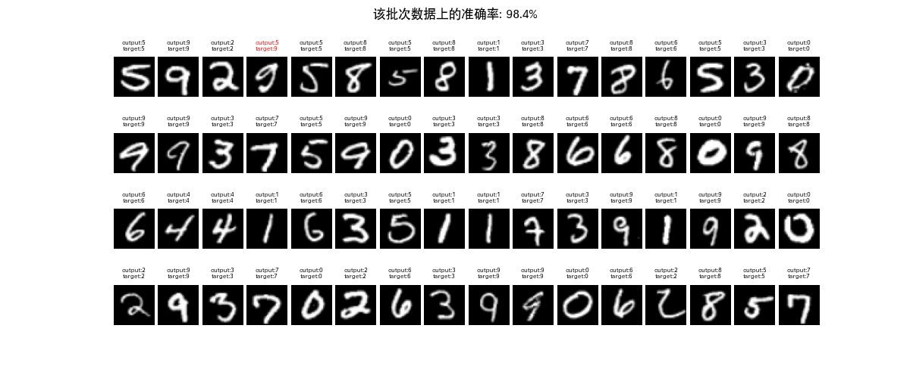

# LeNet5-PyTorch

## 项目描述

LeNet-5是由Yann LeCun等人于1998年提出的经典卷积神经网络，主要用于手写数字识别任务。作为早期CNN的代表性架构，LeNet-5仅包含5层可训练参数层，结构简洁高效，即使在CPU环境下也能快速完成训练。本项目使用PyTorch实现的经典LeNet-5卷积神经网络，在MNIST数据集上进行训练与测试。

## 项目结构

~~~
LeNet5-PyTorch/
├── data/      # 存放数据集
├── data.py    # 数据的处理和加载
├── model.py   # 网络结构定义
├── plot.py    # 可视化工具
├── README.md  # 项目说明文档
├── test.py    # 训练脚本
└── train.py   # 测试脚本
~~~

## 使用指南

1. 开发环境

   - **硬件**：MacBook Air (M4芯片)
   - **操作系统**：macOS Sequoia 15.4.1
   - **Python版本**：3.12
   - **PyTorch版本**：2.7.0

2. 安装依赖

   ~~~shell
   pip install -r requirements.txt

3. 数据集可视化

   ~~~shell
   python plot.py
   ~~~

4. 训练模型（训练日志保存在logs.txt文件）

   ~~~shell
   python train.py > logs.txt
   ~~~

5. 测试模型

   ~~~python
   python test.py
   ~~~

## 实验数据

模型训练20轮次的学习曲线如下，左图是训练集和验证集的**loss曲线**，右图是训练集和验证集的**acc曲线**。

模型在全部测试集上进行测试，准确率是98.7%。

随机从测试集上选取一批次数据（64个数据），准确率是98.4%。

## 总结

本项目通过完整实现LeNet-5，旨在深入掌握PyTorch深度学习框架的核心使用技巧，包括：模型架构搭建、数据预处理与加载、训练流程实现以及模型评估等关键环节。同时，该项目也帮助我系统性地梳理了深度学习项目的标准开发流程和组织结构。

---

**参考**：

- 【Pytorch框架与经典卷积神经网络与实战】https://www.bilibili.com/video/BV1e34y1M7wR
- 【国立台湾大学：李宏毅机器学习】https://speech.ee.ntu.edu.tw/~hylee/ml/2021-spring.php

