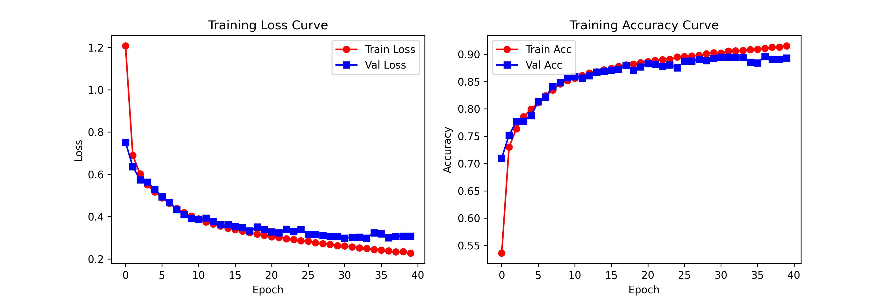

# LeNet5-PyTorch

## 1 Overview

**LeNet-5**, proposed by *Yann LeCun et al.* in 1998, is a classic convolutional neural network (CNN) primarily designed for handwritten digit recognition. As a pioneering CNN architecture, it consists of only **5 trainable layers**, featuring a compact and efficient design that enables rapid training even on CPU environments.

## 2 Architecture

| Layer  | Type      | Configuration             | Input Dim | Output Dim | Activation | Params |
| ------ | --------- | ------------------------- | --------- | ---------- | :--------: | ------ |
| C1     | Conv2d    | 6x5x5 kernels, stride=1   | 1x32x32   | 6x28x28    |  Sigmoid   | 156    |
| S2     | AvgPool2d | 2x2 window, stride=2      | 6x28x28   | 6x14x14    |     -      | 0      |
| C3     | Conv2d    | 16x5x5 kernels, stride=1  | 6x14x14   | 16x10x10   |  Sigmoid   | 2416   |
| S4     | AvgPool2d | 2x2 window, stride=2      | 16x10x10  | 16x5x5     |     -      | 0      |
| C5     | Conv2d    | 120x5x5 kernels, stride=1 | 16x5x5    | 120x1x1    |  Sigmoid   | 48,120 |
| F6     | Linear    | 120->84 fully connected   | 120       | 84         |  Sigmoid   | 10164  |
| Output | Linear    | 84->10 fully connected    | 84        | 10         |  Softmax*  | 850    |

## 3 Implementation

~~~python
class LeNet(nn.Module):
    def __init__(self):
        super(LeNet, self).__init__()

        self.c1 = nn.Conv2d(in_channels=1, out_channels=6, kernel_size=5)
        self.s2 = nn.AvgPool2d(kernel_size=2, stride=2)
        self.c3 = nn.Conv2d(in_channels=6, out_channels=16, kernel_size=5)
        self.s4 = nn.AvgPool2d(kernel_size=2, stride=2)
        self.c5 = nn.Conv2d(in_channels=16, out_channels=120, kernel_size=5)
        self.flatten = nn.Flatten()
        self.f6 = nn.Linear(120, 84)
        self.f7 = nn.Linear(84, 10)

        self.sig = nn.Sigmoid()

    def forward(self, x):
        x = self.sig(self.c1(x))
        x = self.s2(x)
        x = self.sig(self.c3(x))
        x = self.s4(x)
        x = self.sig(self.c5(x))
        x = self.flatten(x)
        x = self.f6(x)
        x = self.f7(x)
        return x
~~~

## 4 Usage

### 4.1Training

~~~shell
python train.py
~~~

### 4.2 Evaluation

~~~shell
python test.py
~~~

## 5 Results

Training curves for 20 epochs: (Left) Train/val loss, (Right) Train/val accuracy.

Evaluation on the complete test set yielded an accuracy of 88.6%.

On a randomly selected batch of 64 samples from the test set, the accuracy reached 84.4%.

## 6 References

- Original Paper: [Gradient-Based Learning Applied to Document Recognition](http://yann.lecun.com/exdb/publis/pdf/lecun-01a.pdf)

